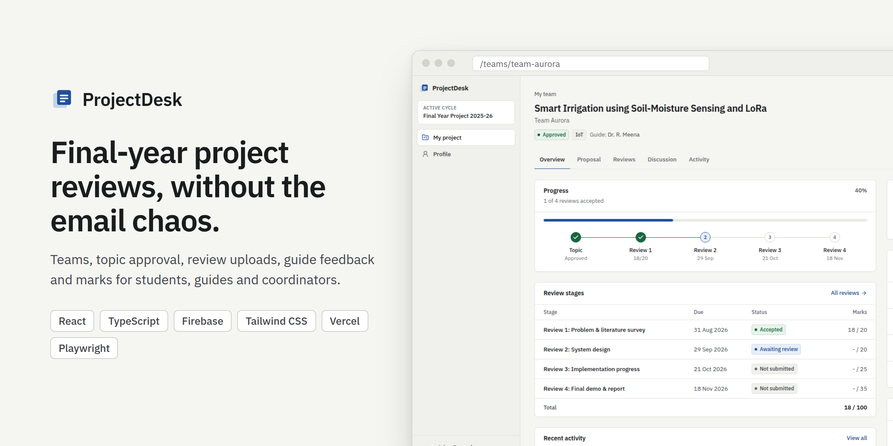
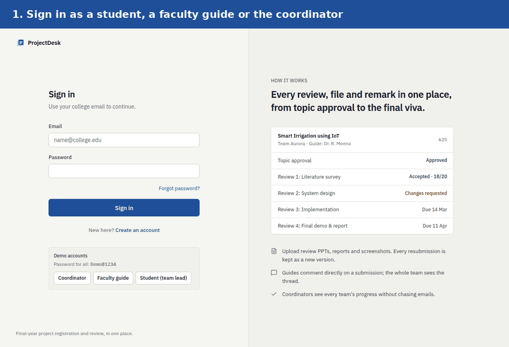
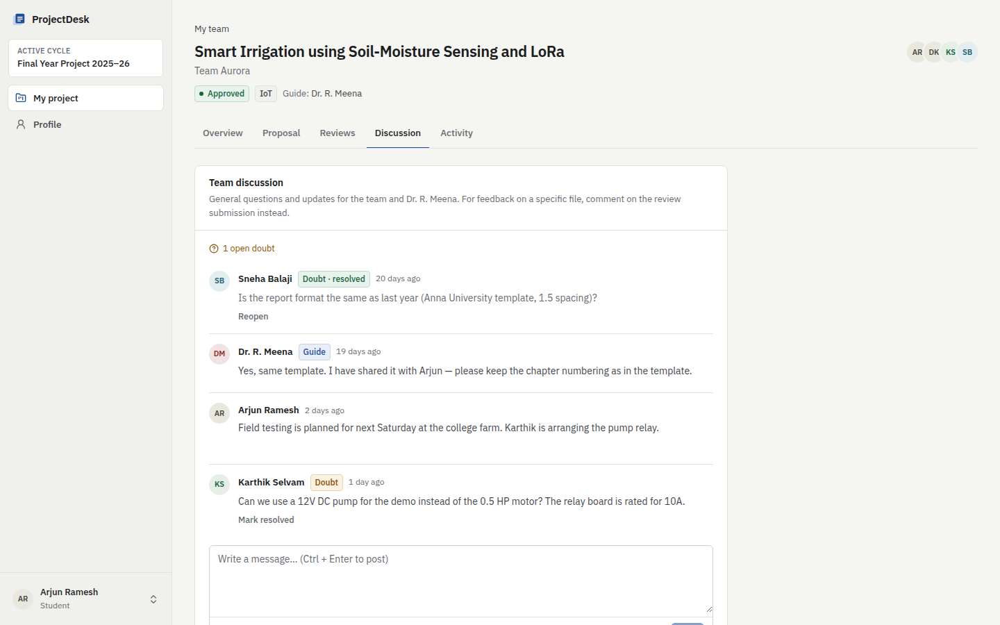
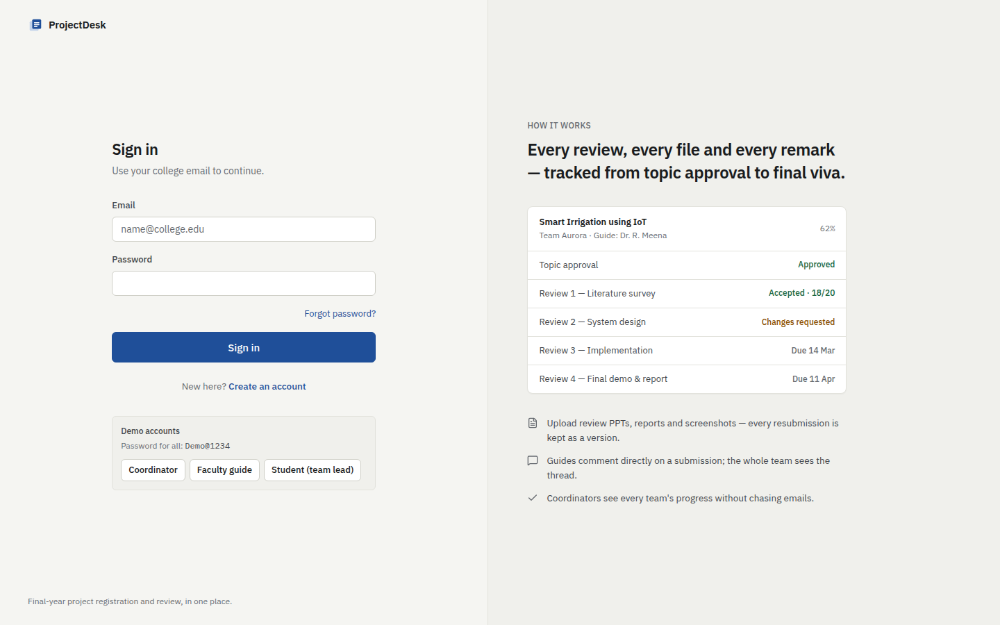
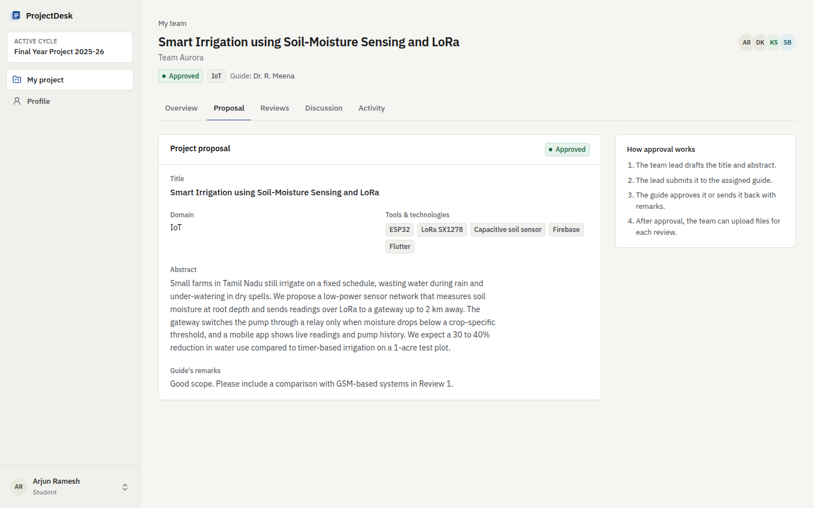
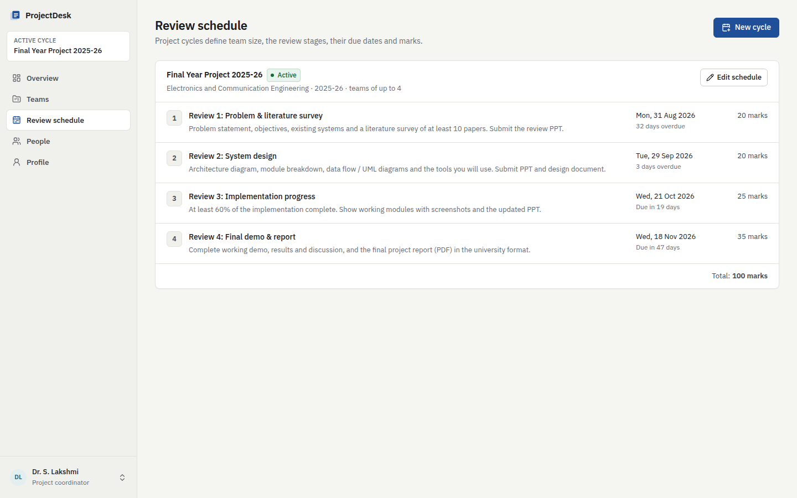
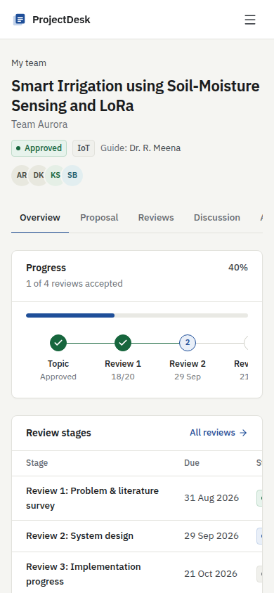
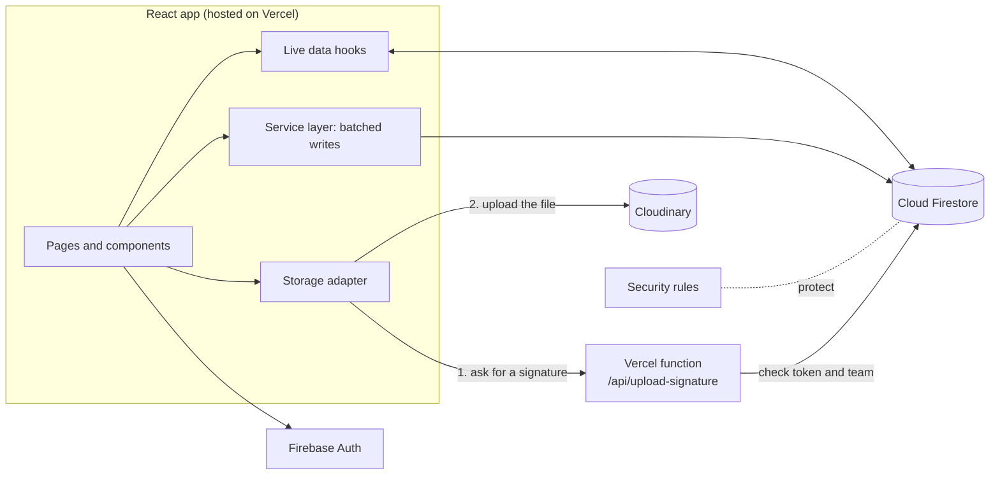
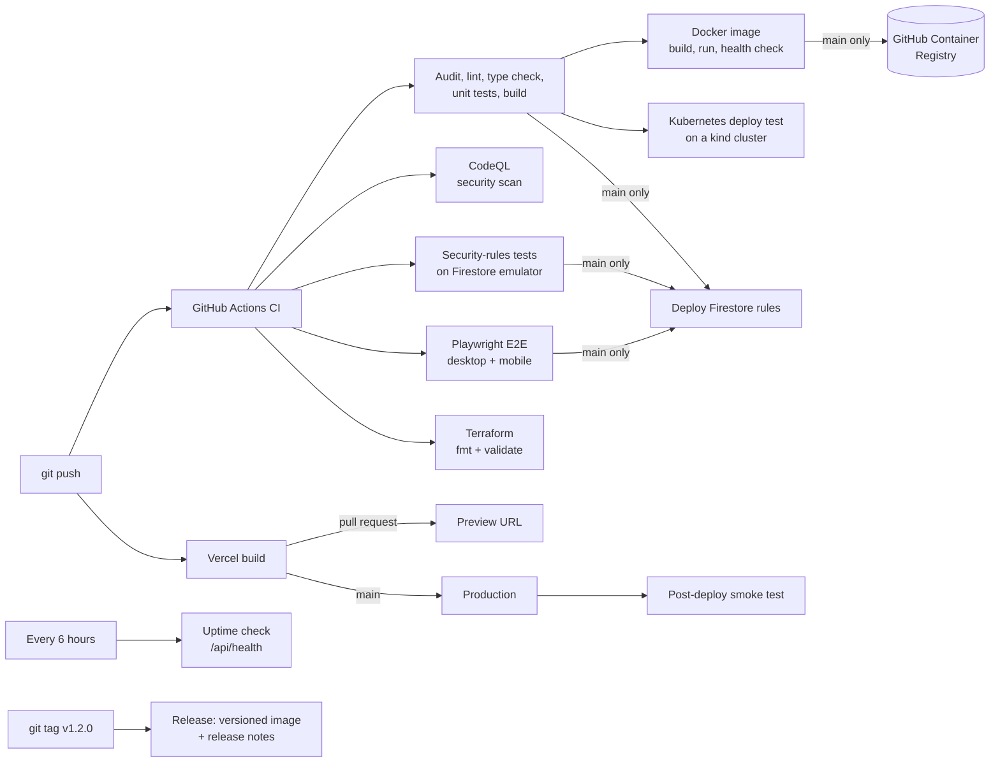

<div align="center">



# ProjectDesk

**A web app that runs the final-year project process for a college department.**
Students form teams and upload their review files, guides give feedback and marks, and the coordinator sees every team's progress in one place.

[](https://github.com/Vishi-vishnu/projectdesk/actions/workflows/ci.yml)
[](https://github.com/Vishi-vishnu/projectdesk/actions/workflows/codeql.yml)
[](https://github.com/Vishi-vishnu/projectdesk/actions/workflows/uptime.yml)


[**Live demo**](https://projectdesk-three.vercel.app) &nbsp;·&nbsp; [How to use it](#how-to-use-it) &nbsp;·&nbsp; [DevOps](#devops-how-code-gets-from-a-commit-to-the-live-site) &nbsp;·&nbsp; [Run it locally](#run-it-locally) &nbsp;·&nbsp; [Architecture](#architecture)

</div>

---

## The problem

In the final year of engineering, every student team builds a project and presents it in four reviews across one semester. For each review, the team prepares a PPT and a report, and the guide gives feedback and marks.

In most colleges this still runs on email and WhatsApp:

- Students send files to the guide one by one, and old and new versions get mixed up.
- Feedback is spread across chats, emails and printed copies, so half the team never sees it.
- The coordinator collects marks from every guide by hand to find out which teams are behind.

I went through this process myself, so I built **ProjectDesk** to put the whole semester in one place.

## What it does

| Who | What they can do |
| --- | --- |
| **Student** | Create a team and become the team lead, or join a team with a 6-character code. Submit the project topic for approval and request a preferred guide. Upload PPTs, PDF reports and images for each review. See the guide's comments and marks, ask doubts in a team discussion, and get a warning when a review deadline is close. |
| **Faculty guide** | Sign up and wait for the coordinator to approve the account. Approve or return project topics. Work through a review queue where late submissions are flagged. Preview files in the browser, comment, and accept a review with marks or ask for changes. |
| **Coordinator** | Set up the project cycle: team size, review stages, due dates and marks. Approve faculty accounts, assign guides by hand or automatically (preferences first, then an even spread), post announcements, track every team on a progress matrix, and export marks to CSV. |

Everything updates live. When a guide posts feedback, it shows up on the team's screen without a page refresh, and a notification bell lists new announcements and team activity. There is a light and a dark theme.

<div align="center">
  
</div>

## Screenshots

| Student: project overview | Guide: evaluating a review |
| --- | --- |
|  |  |
| **Guide: dashboard** | **Coordinator: progress matrix** |
|  |  |
| **Coordinator: assigning guides** | **Team discussion and doubts** |
|  |  |

<details>
<summary>More screens: sign in, proposal, review schedule, mobile</summary>

| Sign in | Project proposal |
| --- | --- |
|  |  |
| **Review schedule** | **Mobile** |
|  |  |

</details>

## Live demo

**Link:** [projectdesk-three.vercel.app](https://projectdesk-three.vercel.app)

The sign-in page has one-click demo logins. All demo accounts use the password `Demo@1234`.

| Role | Email |
| --- | --- |
| Coordinator | `coordinator@demo.projectdesk.app` |
| Faculty guide | `meena@demo.projectdesk.app` |
| Student (team lead) | `arjun@demo.projectdesk.app` |
| Student without a team | `gokul@demo.projectdesk.app` |

## How to use it

A typical semester looks like this:

1. **The coordinator opens a project cycle.** On *Review schedule*, they set the team size and the four review stages with due dates and marks.
2. **Students register and form teams.** One student creates the team and shares the join code. Teammates enter the code to join.
3. **Faculty register and get approved.** The coordinator approves them on *People*, then assigns a guide to each team on *Teams*, one by one or with *Auto-assign guides*.
4. **The team submits its topic.** The team lead fills in the title, abstract and tools on *Proposal* and submits it. The guide approves it or sends it back with remarks.
5. **The team uploads each review.** On *Reviews*, any member uploads files (PDF, PPT/PPTX, DOC/DOCX, PNG, JPG, WEBP, up to 10 MB each). A resubmission becomes a new version, and old versions are kept.
6. **The guide reviews it.** The guide previews the files, comments, and either accepts the review with marks or requests changes. Students can mark a comment as a doubt, and the guide resolves it.
7. **The coordinator tracks everyone.** The *Overview* shows a matrix of every team at every stage, a to-do list, and announcements for students or guides. *Export CSV* downloads all the marks.

## Tech stack

| Layer | Tools |
| --- | --- |
| Frontend | React 19, TypeScript 7, Vite, Tailwind CSS 4, React Router, React Hook Form + Zod, Radix UI |
| Backend | Firebase Authentication, Cloud Firestore (real-time listeners), Firestore security rules |
| File storage | Cloudinary (free plan) with signed uploads from a Vercel serverless function |
| Testing | Vitest, Testing Library, Firebase rules unit testing, Playwright (desktop and mobile) |
| DevOps | GitHub Actions (CI, post-deploy smoke tests, uptime checks), Docker multi-stage build published to GHCR, Kubernetes manifests tested on kind, Terraform for Vercel, Vercel hosting with preview deployments, Dependabot, CodeQL |

## Architecture



A few decisions that shaped the project:

- **Security is enforced on the server.** The browser talks to Firestore directly, so every rule lives in [`firestore.rules`](firestore.rules). Students cannot grade themselves, change their role, read other teams, or post as someone else. Nobody can sign up as a coordinator.
- **Related writes happen together.** Creating a team writes the team, its join code, the student's profile and an activity entry in one batch. Either all of them save or none do.
- **Join codes cannot be reused by others.** The proof of the code is tied to the person joining, and the rules check it.
- **The upload secret never reaches the browser.** A small serverless function checks the user's login token and team membership, then returns a short-lived signature for that team's folder only.
- **Storage can be swapped.** File uploads go through one `StorageProvider` interface, with a Cloudinary version for production and a Firebase Storage version for local development.

More detail is in [docs/ARCHITECTURE.md](docs/ARCHITECTURE.md).

## DevOps: how code gets from a commit to the live site



| Stage | Tool | What happens |
| --- | --- | --- |
| Continuous integration | GitHub Actions ([`ci.yml`](.github/workflows/ci.yml)) | Every push and pull request runs a dependency audit, lint, type check, unit tests, the security-rules tests, Playwright end-to-end tests and a production build, as parallel jobs. |
| Security scanning | CodeQL ([`codeql.yml`](.github/workflows/codeql.yml)), `npm audit` | GitHub's code scanner checks the TypeScript on every push and weekly. CI fails if an app dependency has a known high-severity vulnerability. |
| Containers | Docker, GitHub Container Registry | A multi-stage [`Dockerfile`](Dockerfile) builds the app with Node and serves it from a small nginx image with a health check. CI builds it, runs it, checks it responds, and on `main` pushes it to `ghcr.io` tagged with the commit. `docker compose up --build` runs the same image locally. |
| Kubernetes | kind in CI, manifests in [`k8s/`](k8s) | The image runs as a Deployment with 2 pods, readiness and liveness probes, CPU and memory limits and rolling updates, behind a Service. CI creates a throwaway cluster, deploys it, waits for the rollout and calls the app. [How to run it locally](k8s/README.md). |
| Infrastructure as code | Terraform, files in [`infra/terraform`](infra/terraform) | The Vercel project (GitHub link, build settings, all environment variables) is described in code, so the hosting can be rebuilt with `terraform apply`. CI runs `terraform fmt` and `terraform validate`. [How to use it](infra/terraform/README.md). |
| Continuous deployment | Vercel | Every pull request gets its own preview URL. Merging to `main` deploys to production. Firestore rules are deployed from CI once all tests pass. |
| Release check | Playwright ([`post-deploy.yml`](.github/workflows/post-deploy.yml)) | After each production deploy, read-only smoke tests hit the live URL: the health endpoint, the sign-in page, SPA routing and the upload guard. |
| Monitoring | GitHub Actions ([`uptime.yml`](.github/workflows/uptime.yml)) | Every 6 hours a job calls `/api/health`. It returns 503 if a server setting is missing, and a failed run sends an email. |
| Dependencies | Dependabot ([`dependabot.yml`](.github/dependabot.yml)) | Weekly grouped pull requests for npm packages, GitHub Actions and Docker base images, each checked by the full CI pipeline. |
| Releases | GitHub Actions ([`release.yml`](.github/workflows/release.yml)) | Pushing a tag like `v1.2.0` publishes the Docker image with that version and creates a GitHub Release with generated notes. |
| Secrets | Vercel environment variables | The Cloudinary secret lives only on the server. Nothing secret is in the repo or the browser bundle. |

Rollback steps, secret rotation and the rest of the runbook are in [docs/DEVOPS.md](docs/DEVOPS.md).

### What the tests cover

| Layer | What is covered |
| --- | --- |
| Unit | Deadline and progress logic, guide auto-assignment, notifications, file checks, CSV export, upload signatures, health report |
| Security rules | 39 tests with 81 allow and deny checks across every collection |
| End-to-end | A full semester across all three roles, resubmissions, file previews, upload limits, approvals, announcements, auto-assignment, password change, the light/dark toggle and the mobile layout |
| Smoke (live site) | Health endpoint, sign-in page, deep links and the upload guard after every production deploy |

The longest end-to-end test plays out a whole semester. A student registers and creates a team, and a classmate joins with the code. The coordinator assigns a guide, who approves the topic. The student uploads Review 1 and asks a doubt, and the guide replies, resolves it and gives marks.

## Run it locally

You need Node.js 22.12 or later.

```bash
git clone https://github.com/Vishi-vishnu/projectdesk.git
cd projectdesk
npm install

# Quickest: runs in the browser with demo data, no accounts needed
npm run dev:fake
```

Then open http://localhost:5173 and use one of the demo logins above.

<details>
<summary>Run with the real Firebase stack on local emulators</summary>

This needs Java 21 for the Firebase emulators.

```bash
npm run emulators       # terminal 1: Auth, Firestore and Storage emulators
npm run seed            # terminal 2: demo accounts and data
npm run dev:emulator    # terminal 2: app at http://localhost:5173
```

</details>

<details>
<summary>Useful scripts</summary>

| Command | What it does |
| --- | --- |
| `npm run check` | Lint, type check and unit tests |
| `npm run test:e2e` | Playwright end-to-end tests |
| `npm run test:rules` | Security-rules tests on the Firestore emulator |
| `BASE_URL=https://... npm run test:smoke` | Read-only smoke tests against a live deployment |
| `npm run docker:up` | Build and run the production Docker image on port 8080 |
| `npm run seed:live` | Load demo accounts into your Firebase project (key file in Downloads) |
| `npm run build` | Production build |

</details>

To deploy your own copy for free (Firebase Spark, Cloudinary free plan and Vercel Hobby), follow [docs/SETUP.md](docs/SETUP.md).

## Project structure

```
api/                   Vercel serverless functions: signed uploads and /api/health
k8s/                   Kubernetes manifests (Deployment, Service, probes)
infra/terraform/       The Vercel project and its settings as code
e2e/                   Playwright end-to-end tests
scripts/seed.ts        Demo data for the emulator or a real project
src/
  components/ui/       Buttons, fields, dialogs, badges and other building blocks
  components/domain/   File uploader, comment thread, review tracker, activity feed
  pages/               Screens for students, guides and the coordinator
  services/            Every database write, grouped by feature
  hooks/               Real-time data hooks
  lib/                 Types, progress logic, file checks, storage adapters
tests/rules/           Security-rules tests
firestore.rules        Who can read and write what
```

## What I would add next

- Email alerts when a guide posts feedback or a deadline is close (the in-app bell already covers this inside the app)
- A cleanup job for files whose submission failed to save
- Rate limiting and Firebase App Check on the upload endpoint
- Support for several departments, each with its own coordinator

## Author

**Vishnu Kumar G K**

[](https://www.linkedin.com/in/vishnu081/)
[](https://github.com/Vishi-vishnu)

If you have feedback or ideas, feel free to open an issue or reach out on LinkedIn.

## License

[MIT](LICENSE)
