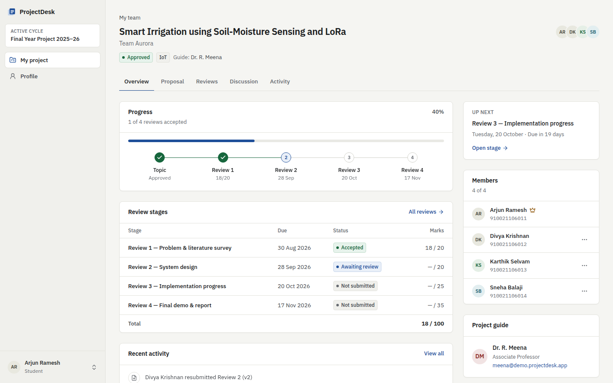
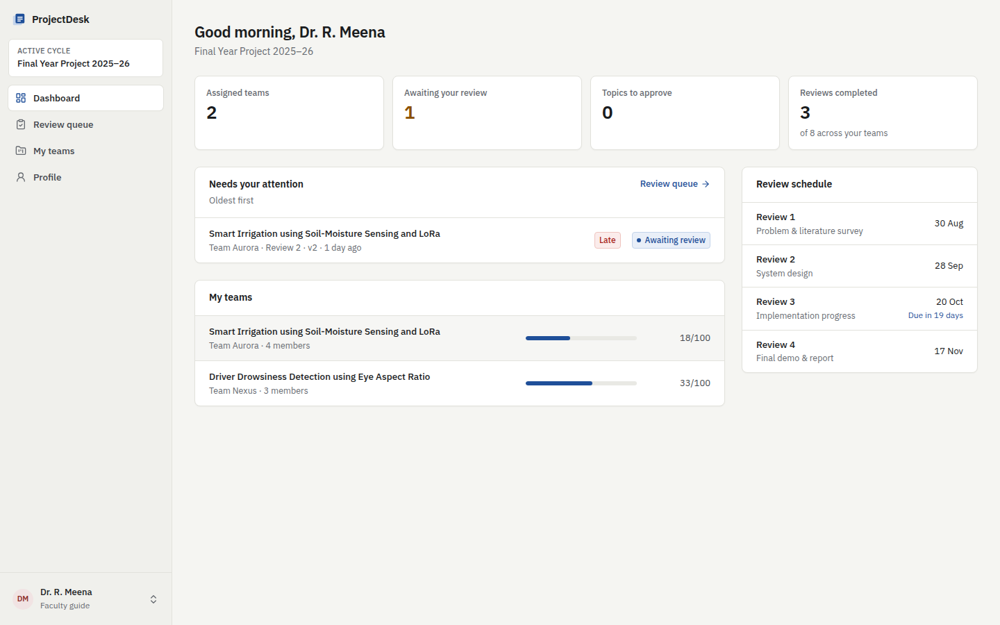
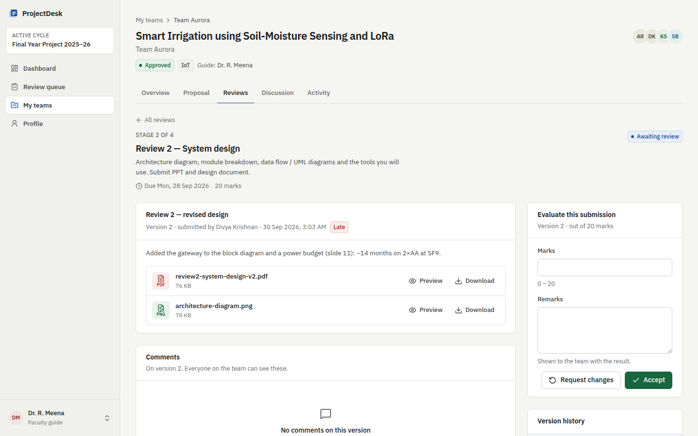
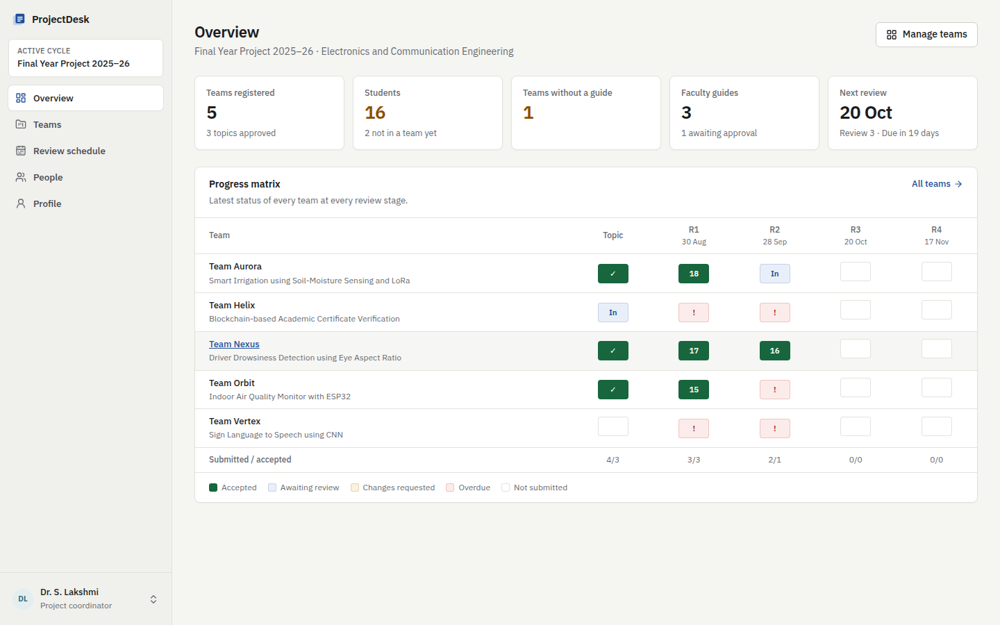
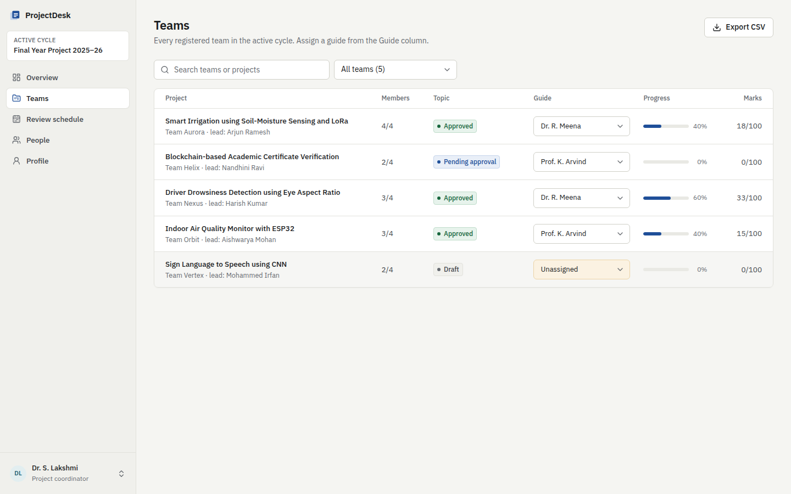
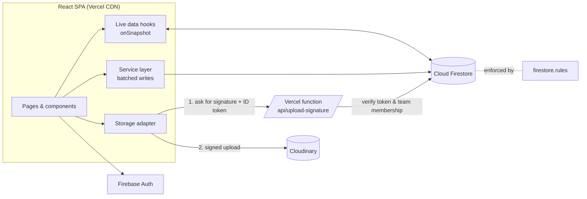

# ProjectDesk

**Final-year project registration and review platform for colleges.**
Students form teams and submit their review files, guides comment and award marks, and the project coordinator tracks every team from topic approval to final demo in one place. It replaces the usual email and WhatsApp collection process.



**Live demo:** _add your Vercel URL here_. The sign-in page has one-click demo accounts for all three roles (password `Demo@1234`).

---

## The problem

In most colleges, final-year projects go through a topic approval and four reviews over one semester. Students email their PPTs and reports to their guide, and feedback is spread across emails, WhatsApp and printed copies. The coordinator has to collect marks from each guide by hand. Files get lost, submissions get duplicated, and nobody can see at a glance which teams are behind.

## What it does

| Role | What they can do |
| --- | --- |
| **Student** | Register, then create a team (and become the team lead) or join one with a 6-character code. Draft the project proposal and submit it for approval. Upload PDFs, PPTs, DOCs and images for each review. Every resubmission is kept as a new version. Read the guide's remarks and marks, ask doubts, and discuss in a team thread. |
| **Faculty guide** | Sign up; the account stays pending until the coordinator approves it. See your assigned teams, approve or return project topics, work through a review queue (oldest first, late submissions flagged), preview files in the browser, comment, and accept or request changes with marks. |
| **Project coordinator** | Create a project cycle with its review stages, due dates and marks. Approve faculty accounts, assign a guide to each team, see a progress matrix of every team at every stage, and export marks to CSV. |

Updates are real-time. When a guide posts feedback, it appears on the team's screen without a page refresh.

## Screenshots

| Faculty dashboard | Evaluating a submission |
| --- | --- |
|  |  |
| **Coordinator progress matrix** | **Guide assignment** |
|  |  |

## Tech stack

- **Frontend:** React 19, TypeScript, Vite, Tailwind CSS v4, React Router, React Hook Form + Zod, Radix UI primitives
- **Backend:** Firebase Authentication and Cloud Firestore (real-time listeners), with Firestore security rules as the authorization layer
- **File storage:** Cloudinary (free tier) through a signed-upload serverless function on Vercel. The Firebase Storage adapter is used with the local emulator.
- **Testing:** Vitest and Testing Library (unit and component), `@firebase/rules-unit-testing` (security rules), Playwright (end-to-end, desktop and mobile)
- **DevOps:** GitHub Actions CI (lint, type-check, unit, rules and E2E tests, build, rules deploy), Vercel hosting with preview deployments, and a multi-stage Docker image served by nginx

## Architecture



Key decisions (details in [docs/ARCHITECTURE.md](docs/ARCHITECTURE.md)):

- **Security lives in the rules, not the UI.** Every write is validated server-side: who can grade, who can join a team, and the fact that nobody can register as a coordinator. For example, joining a team requires the secret join code, and the proof is tied to the joining user's ID so it can't be replayed.
- **Atomic batched writes.** Creating a team writes the team, its join code, the student's profile link and an activity-log entry in one batch. The rules cross-check them with `getAfter()`, so the data can't end up half-written.
- **Pluggable storage.** A `StorageProvider` interface has Firebase Storage and Cloudinary implementations, chosen at build time. The free Firebase plan no longer includes Storage, so production uses Cloudinary. The API secret stays on the server.
- **Submissions are immutable and versioned.** Resubmitting creates v2, v3 and so on, and the full history and every remark are kept.

## Run it locally

Requires Node 20+.

```bash
npm install

# Option A: no setup at all. Uses an in-browser fake backend with demo data.
npm run dev:fake            # http://localhost:5173

# Option B: the real Firebase stack on local emulators (needs Java 21)
npm run emulators           # terminal 1: Auth, Firestore, Storage + UI at :4000
npm run seed                # terminal 2: demo accounts and data
npm run dev:emulator        # terminal 2: http://localhost:5173
```

Demo logins (password `Demo@1234`): `coordinator@demo.projectdesk.app`, `meena@demo.projectdesk.app` (guide), `arjun@demo.projectdesk.app` (student team lead).

## Tests

```bash
npm run check        # lint + type-check + unit tests
npm run test:rules   # Firestore security rules against the emulator
npm run test:e2e     # Playwright: full journeys for all three roles + mobile layout
```

The end-to-end suite runs a complete semester in a single test: a student registers, creates a team and submits a proposal; a classmate joins with the code; the coordinator assigns a guide; the guide approves the topic; the student uploads Review 1 and raises a doubt; the guide replies, resolves the doubt and awards marks; and the team sees the result.

## Deploy (free tier)

See **[docs/SETUP.md](docs/SETUP.md)** for the step-by-step guide covering the Firebase project on the Spark plan, a Cloudinary account, Vercel and GitHub secrets.

## Project structure

```
api/                    Vercel serverless function (Cloudinary upload signing)
e2e/                    Playwright end-to-end tests
scripts/seed.ts         Demo data seeder (emulator or production)
src/
  components/ui/        Design-system primitives (Button, Field, Dialog, Badge…)
  components/domain/    FileUploader, CommentThread, ReviewStepper, ActivityFeed…
  context/              Auth state (Firebase user + live profile document)
  hooks/                Real-time Firestore hooks
  lib/                  Types, progress logic, file validation, storage adapters
  pages/                Route screens per role (student, faculty, coordinator, team)
  services/             All Firestore writes, grouped by domain
  testing/              Seed data and the in-browser fake backend for UI tests
tests/rules/            Security-rules unit tests
firestore.rules         Authorization — the real source of truth
```

## License

MIT
